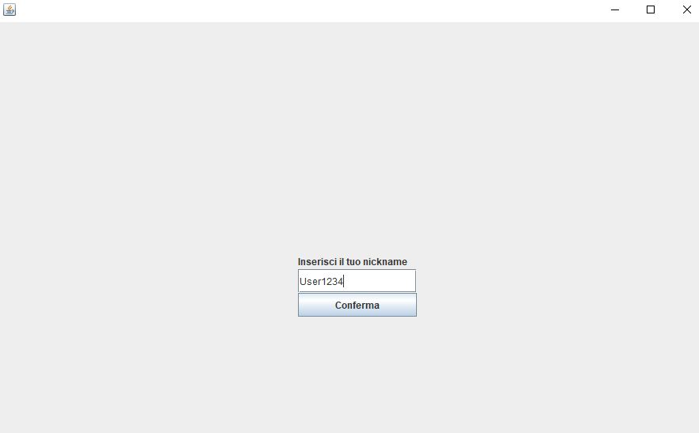
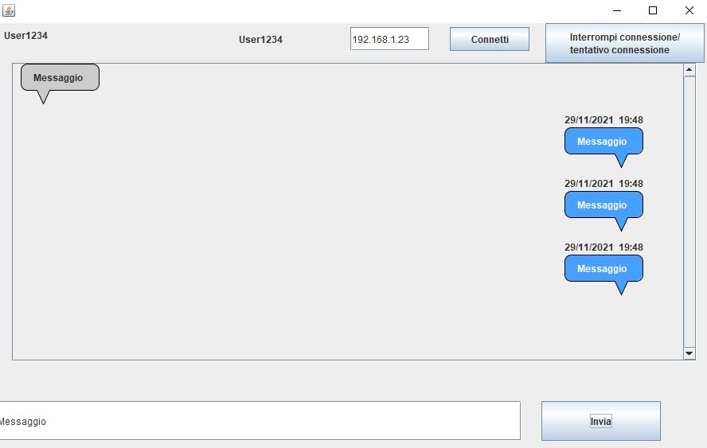

# UDP Chat
UDP chat è una chat peer to peer che utilizza il protocollo UDP per la comunicazione. 
Ogni peer come prima cosa deve inserire il proprio nickname appena inviato il programma attraverso la seguente schermata:

In seguito all'utente comparirà la seguente schermata:

L'utente da questa schermata potrà decidere di stabilire una nuova connessione (inserendo l'IP dell'altro peer nella TextBox e premendo connetti), accettare richieste di connessione (appare un popup quando arrivano), inviare messaggi oppure interrompere una connessione.
In questa schermata in alto a sinistra è visualizzato il proprio nickname, mentre, in alto in centro quello dell'altro peer
